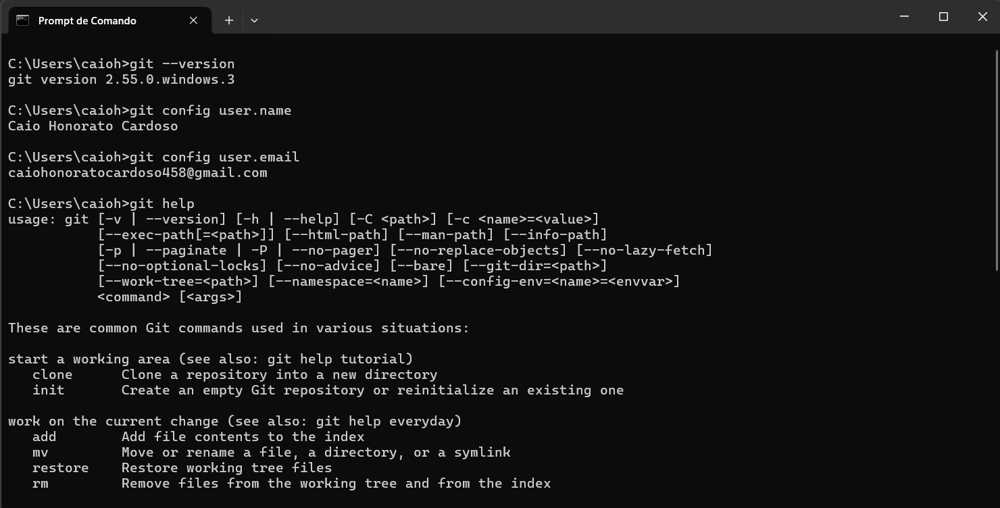

# Atividade 02

## Questão (1) Conforme seu sistema operacional, acessar área de download do Git e executar instruções para instalação;

Eu já tinha o git instalado na máquina.

## Questões (2); (3) e (4):

