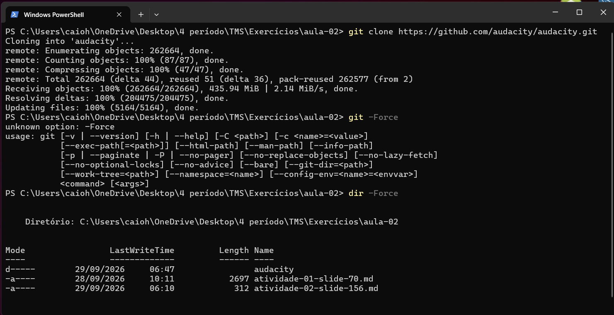
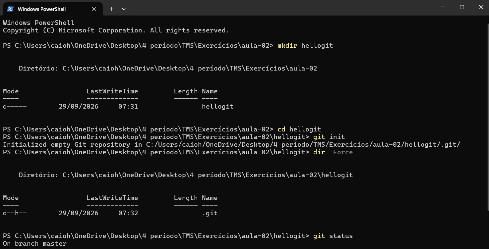
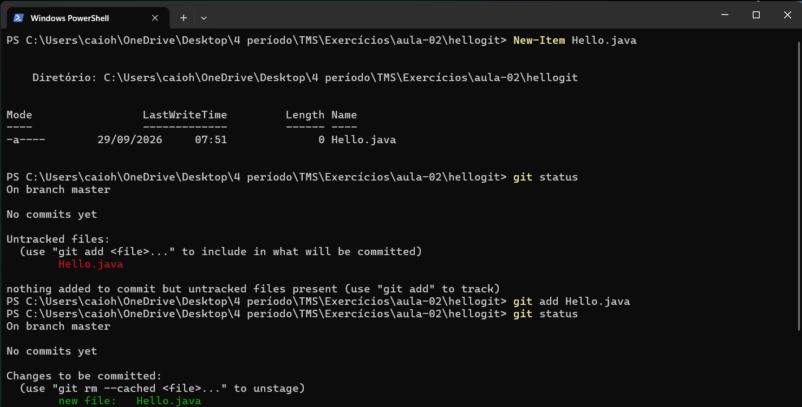
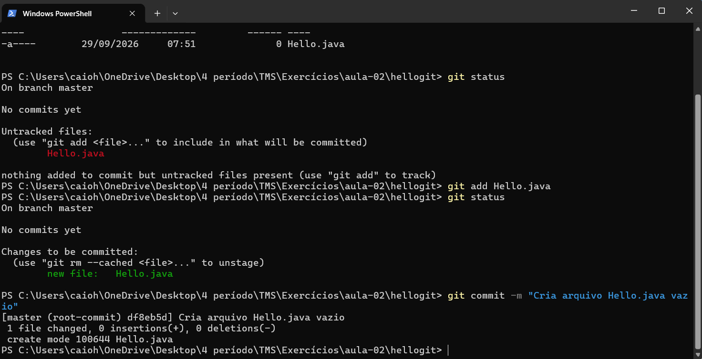
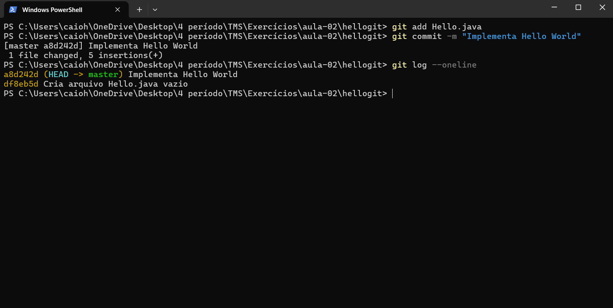

# Atividade 03

## Questão (1) Pesquise alguns projetos no GitHub e liste ao menos três de seu interesse;

| Projeto | Descrição | Repositório |
|---|---|---|
| Shotcut | Editor de vídeo multiplataforma gratuito e open source para Windows, Mac e Linux | github.com/mltframework/shotcut |
| OpenShot | Projetado para ser o editor de vídeo open source mais fácil de aprender, lembrando softwares como o antigo Windows Movie Maker | github.com/OpenShot/openshot-qt |
| Audacity | Editor de áudio multifaixa fácil de usar, para Windows, macOS, GNU/Linux e outros sistemas; software livre e open source escrito em C++, lançado originalmente em 2000 | github.com/audacity/audacity |

## Questão (2) Escolha uma pasta e clone um desses projetos, observando o que foi gerado;

<!-- Confundi o comando para mostrar os arquivos do diretório, k k. -->

## Questão (3) Crie uma pasta "hellogit" e inicialize um novo repositório git nele; Verifique o que foi criado na pasta;

## Questão (4) Crie um arquivo em branco Hello.java e registre no repositório;

## Questão (5) Complete com o código para gerar um "Hello World" e repita o processo indicando as alterações feitas.

