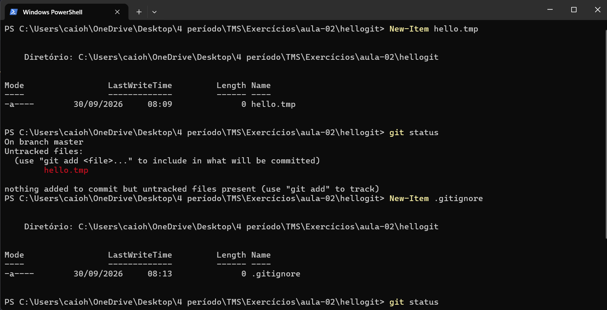
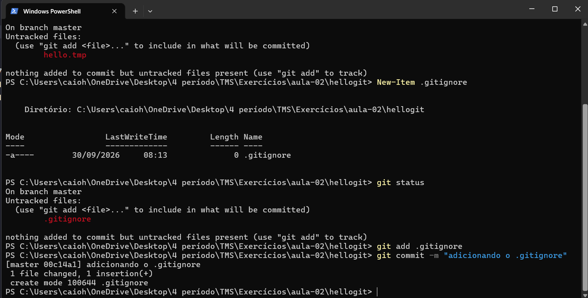
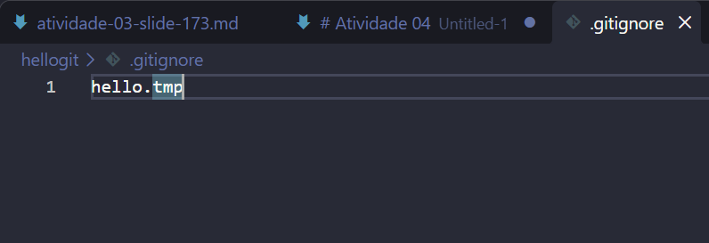

# Atividade 04

## Questão (1) Descreva o resultado esperado para um repositório com um arquivo .gitignore contendo:

O repositório vai ignorar a pasta build inteira (onde estiver), o arquivo TODO só se estiver na raiz, arquivos .txt soltos direto dentro de doc/, e arquivos .pdf em qualquer subpasta de doc/; mas vai continuar rastreando o lib.a, mesmo que uma regra anterior o tivesse bloqueado.

## Questões (2); (3) e (4):

