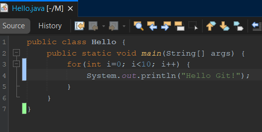
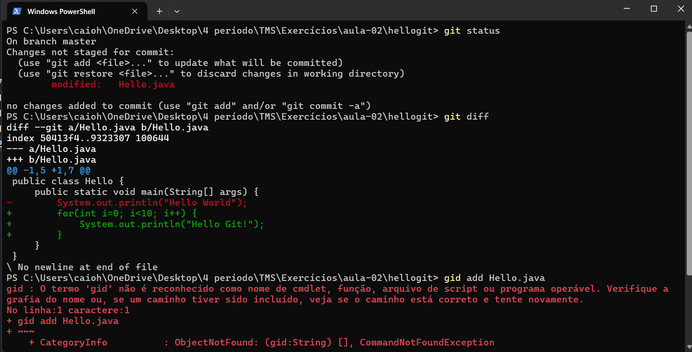
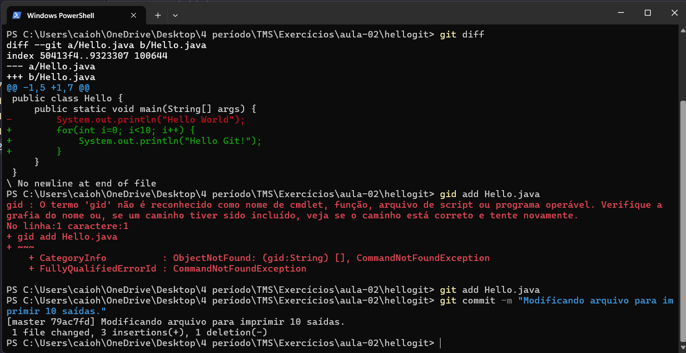
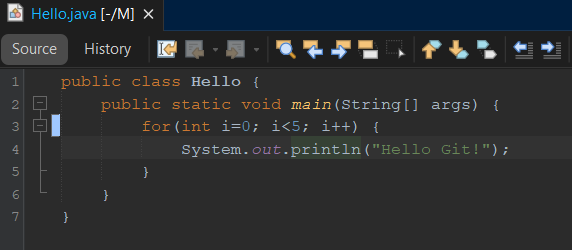
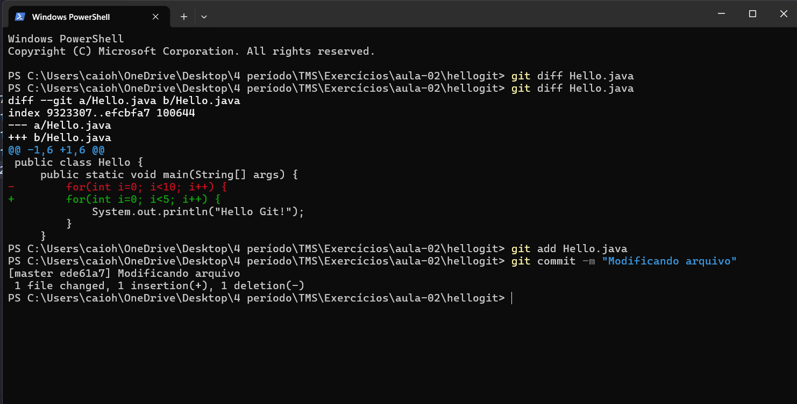
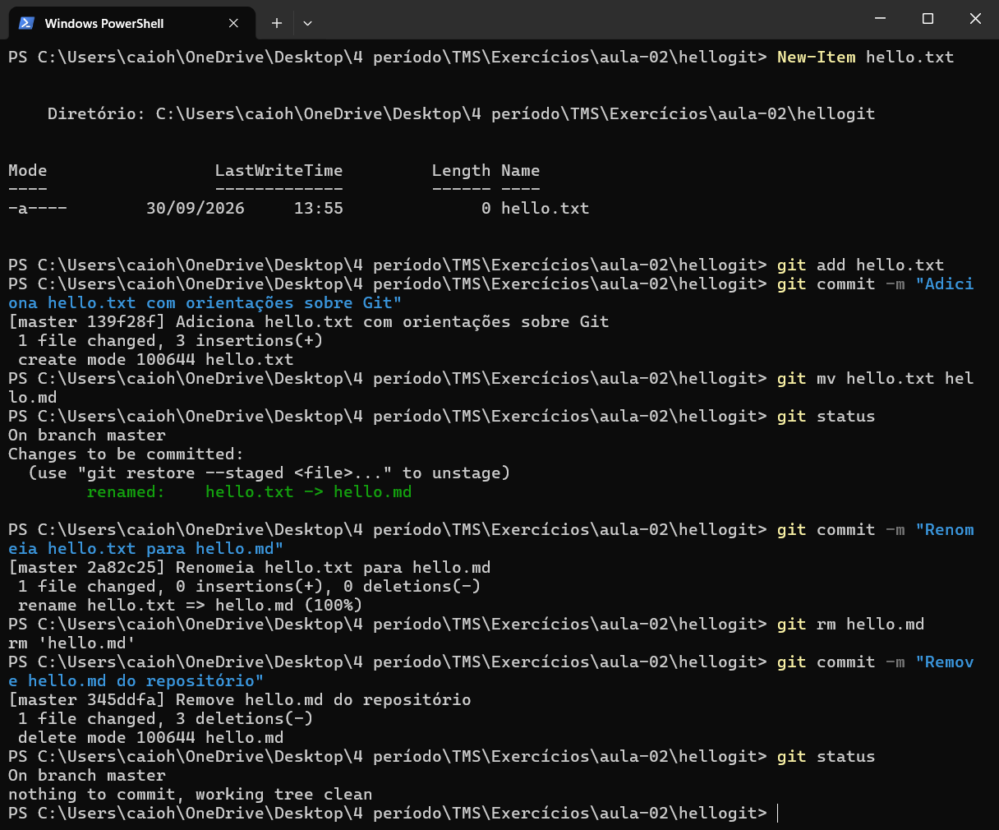

# Atividade 05

## Questão (1) Altere o arquivo hello.java para que gere dez saídas "Hello Git!";

## Questão (2) Observe o "status" e diferenças, a seguir registre a versão atualizada no repositório;

## Questão (3) Observe a diferença entre os arquivos. Repita o processo fazendo novas modificações;

## Questão (4); (5) e (6):

