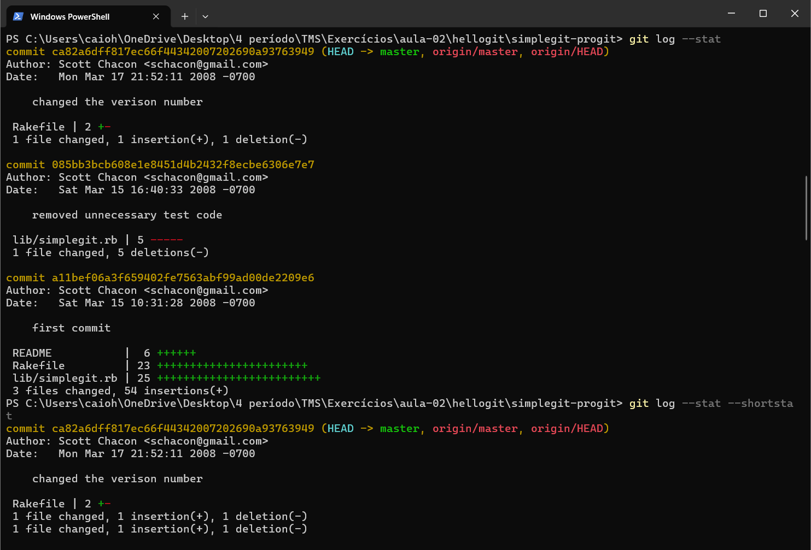
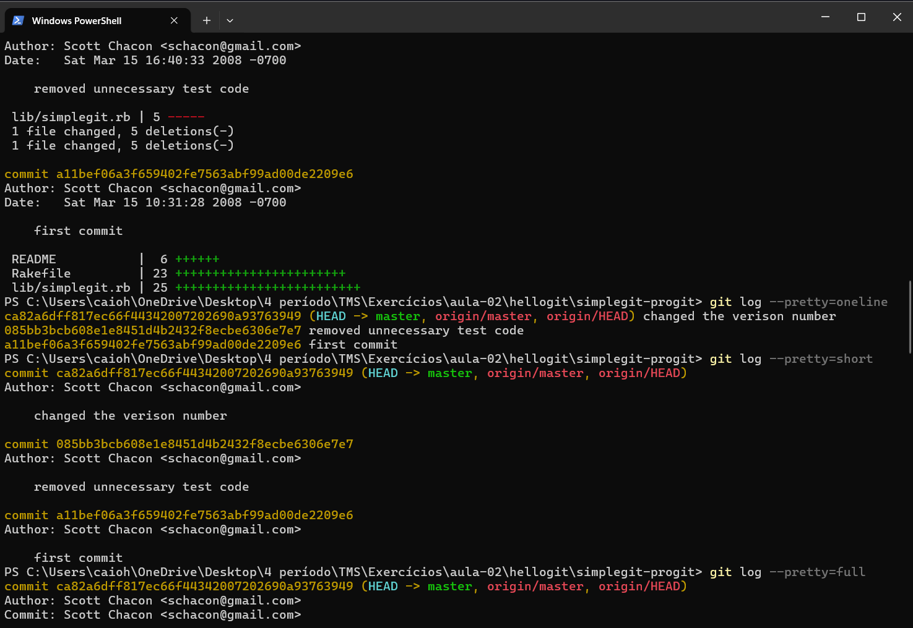
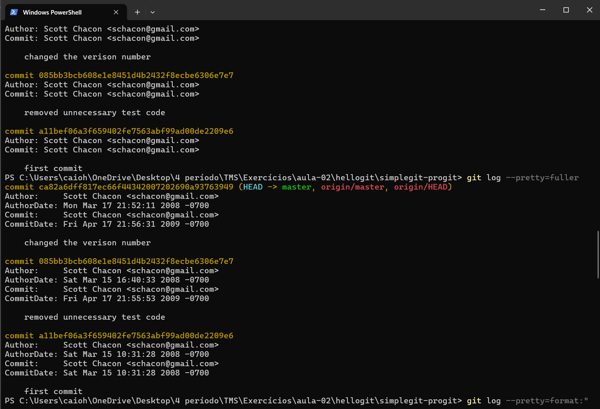
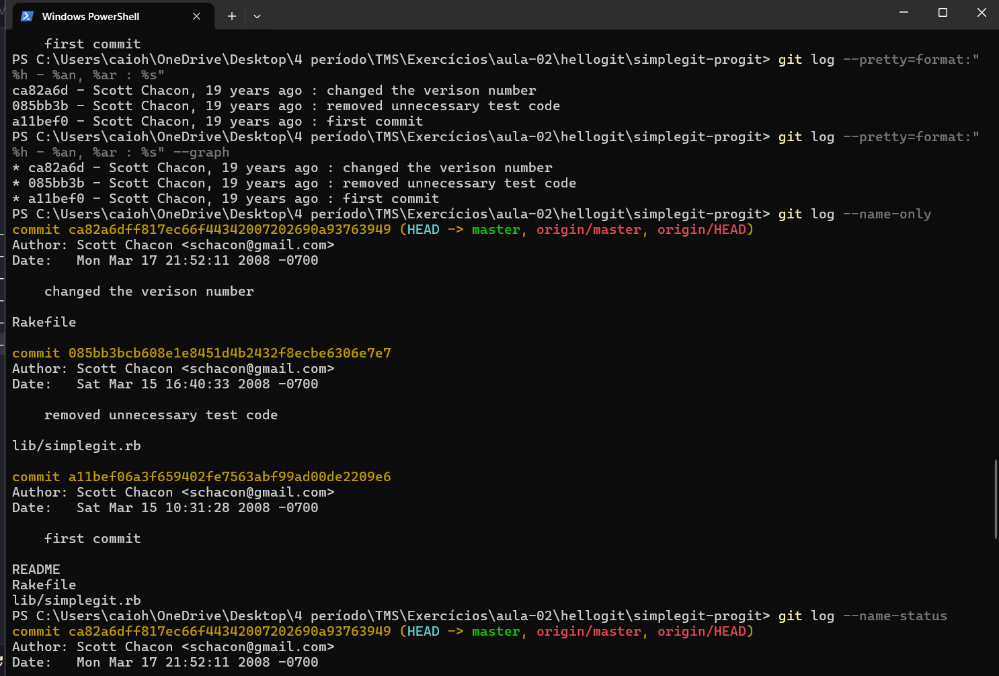
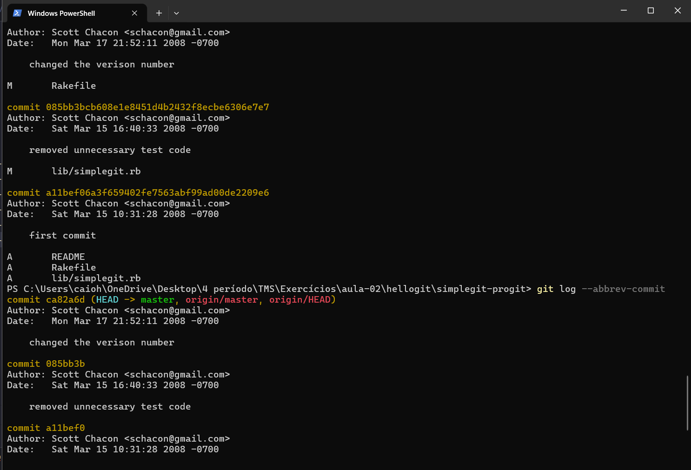
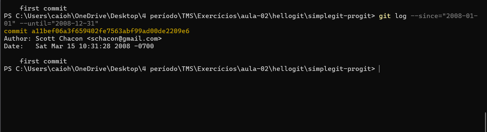
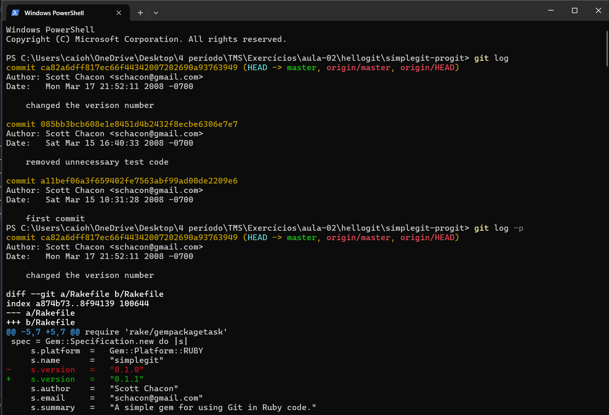
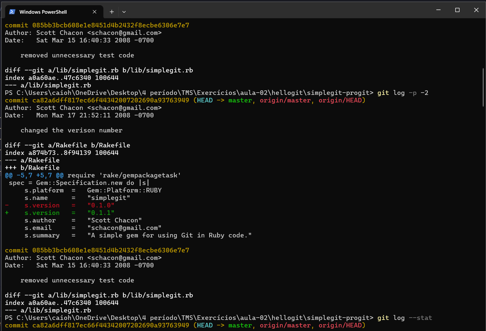
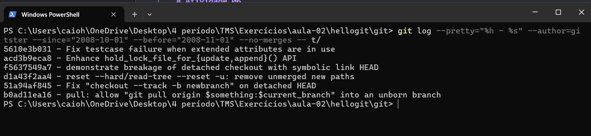

# Atividade 06

## Questão (1) Considerando o repositório clonado do git, teste cada um dos comandos apresentados antes para visualizar o histórico interpretando as saídas;

## Questão (2) Teste a consulta a seguir no repositório com o código do próprio Git: git log --pretty="%h - %s" --author=gitster - since="2008-10-01" --before="2008-11-01" --no merges -- t/

## Questão (3) Analise e interprete os resultados apresentados pela consulta.

| Parte | Filtro aplicado |
|:---:|:---:|
| --pretty="%h - %s" | formato: hash abreviado seguido da mensagem do commit |
| --author=gitster | só commits cujo autor é gitster |
| --since="2008-10-01" | só commits a partir de 1º de outubro de 2008 |
| --before="2008-11-01" | só commits até 1º de novembro de 2008 (na prática, delimita o mês de outubro/2008) |
| --no-merges | exclui commits de merge (mostra só commits "de conteúdo") |
| -- t/ | restringe aos commits que alteraram arquivos dentro da pasta t/ (onde ficam os testes do Git) |

O que isso mostra: a combinação desses filtros responde a uma pergunta bem específica — "quais mudanças o gitster fez nos testes (t/) do Git, durante outubro de 2008, sem contar merges?" É um exemplo prático de como usar o git log para investigação, por exemplo, para auditoria de código, revisão histórica de um módulo específico, ou rastrear quando um bug foi introduzido por um autor em particular.