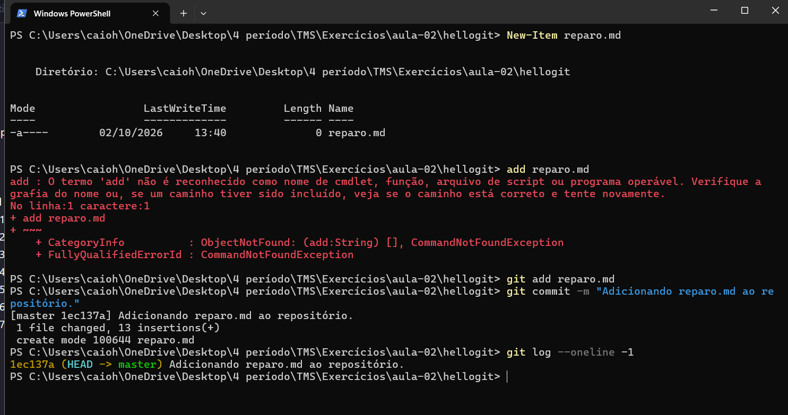
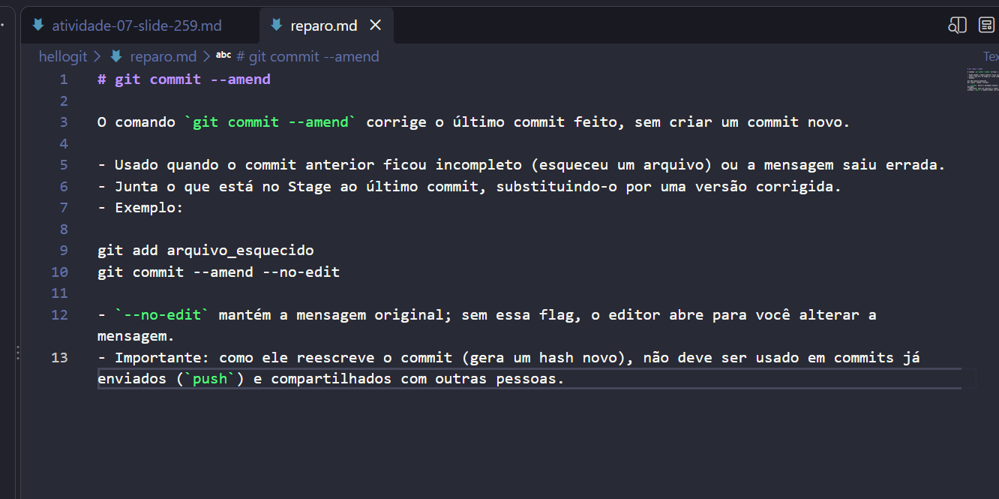
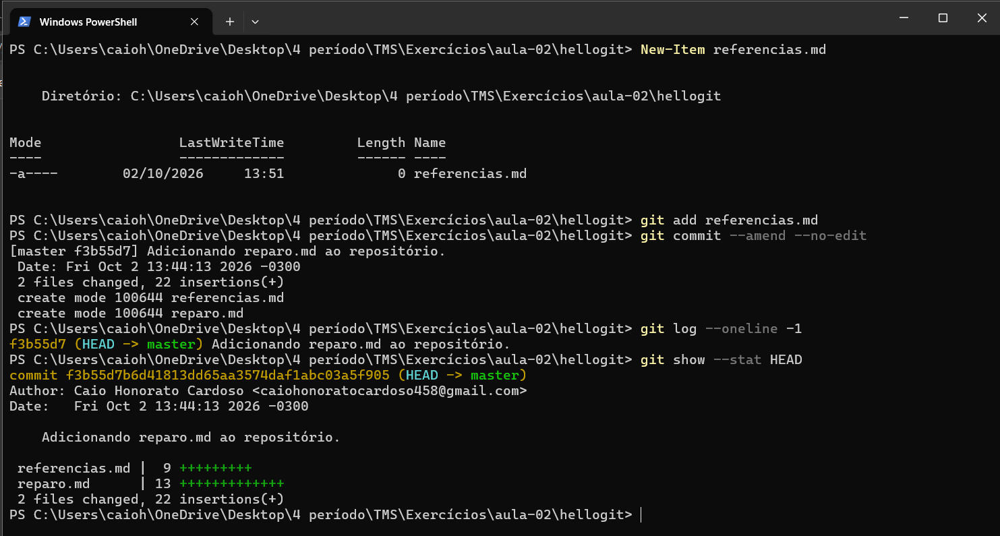
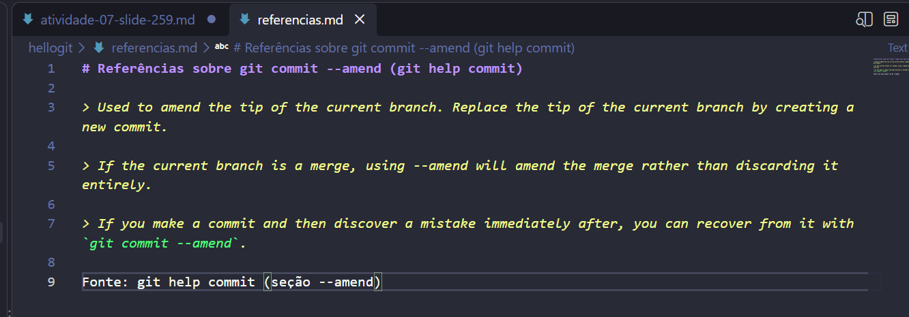
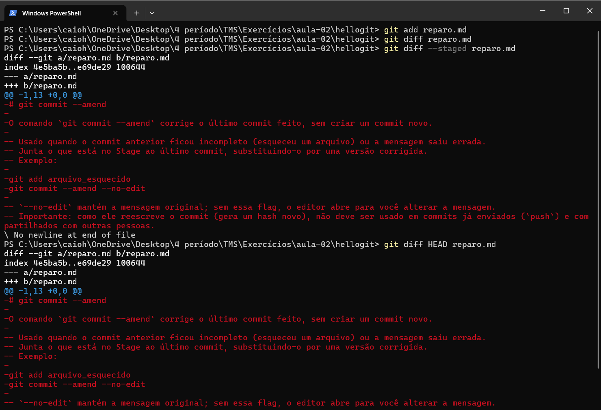
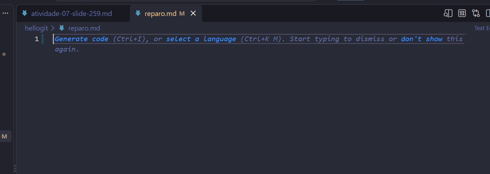
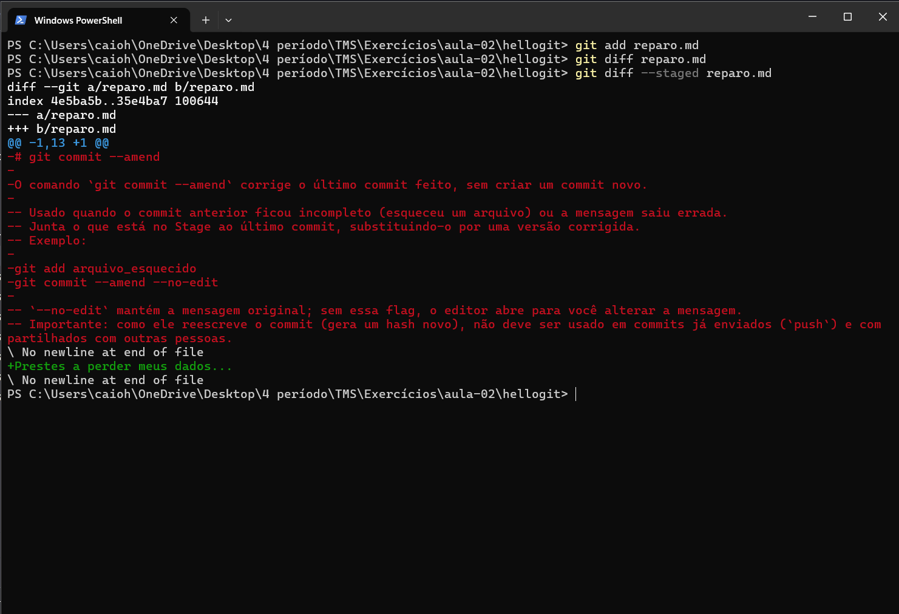
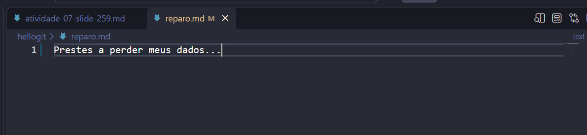
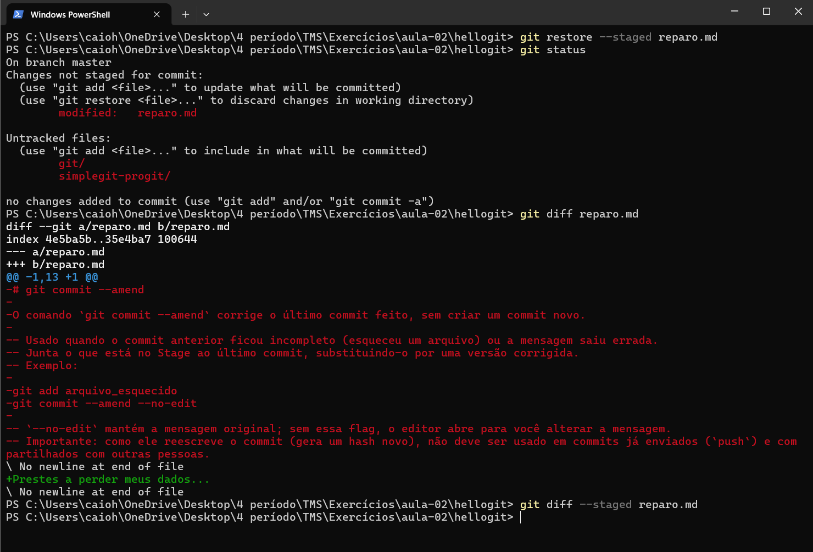
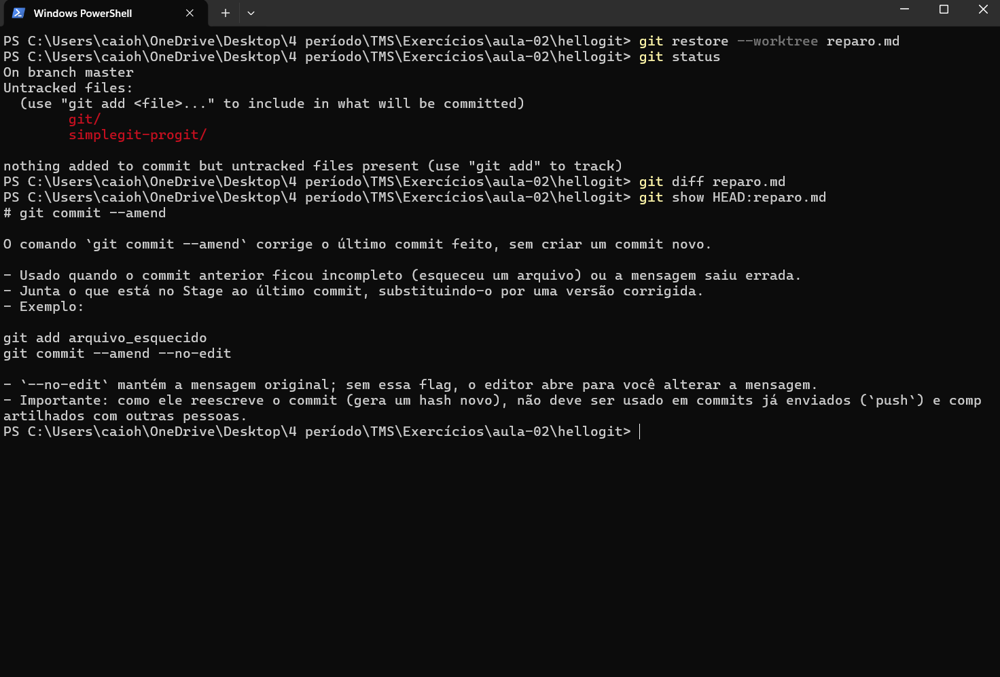

# Atividade 07

## Questão (1) Crie um arquivo reparo.md. Inclua nele as orientações sobre o uso do comando amend para atualizar um commit. Registre o arquivo no repositório indicando o que fez. Conforme que o commit foi realizado.

<!-- Errei um comando sem querer... -->

## Questão (2) Lembrando-se que um arquivo extra referencias.md deveria fazer parte do commit anterior, crie o arquivo, inclua referências sobre o uso do comando ammend retiradas da ajuda do Git e associe ao commit realizado.

## Questão (3) Edite o arquivo reparo.md apagando seu conteúdo e adicionando essa nova versão ao Stage. Conforme a inclusão das edições usando diff entre as diferentes versões do arquivo (Stage, Área de Trabalho e Repositório).

## Questão (4) Edite novamente o arquivo reparo.md e inclua o texto Prestes a perder meus dados.... Novamente, observe a diferença entre os arquivos.

## Questão (5) Remova o arquivo do Stage, repetindo as verificações.

## Questão (6) Restaure o arquivo original registrado, descartando as edições mais recentes feitas na área de trabalho.

