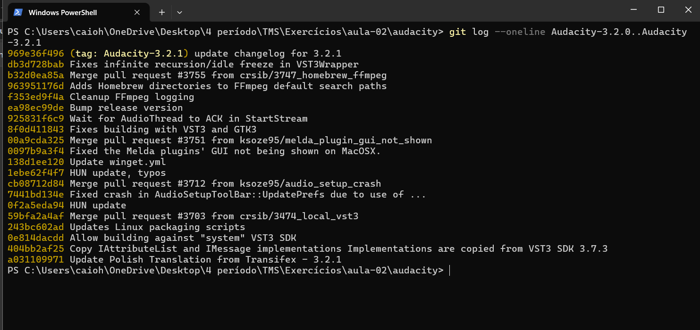
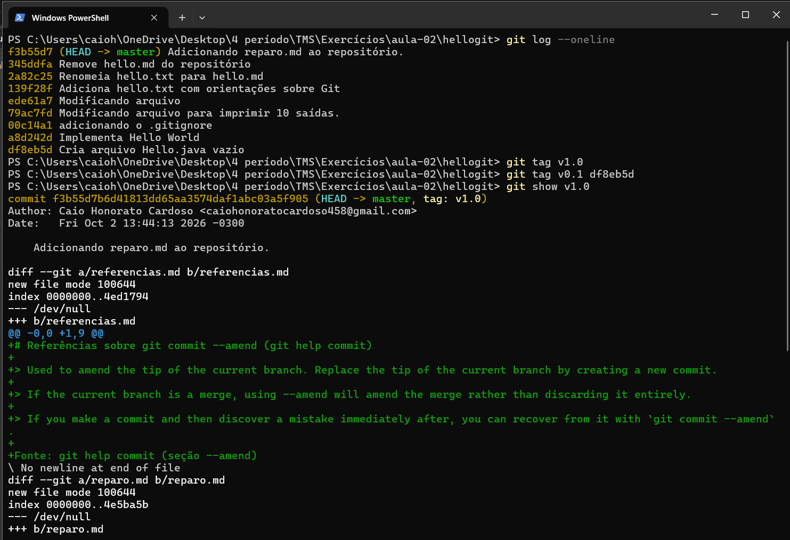
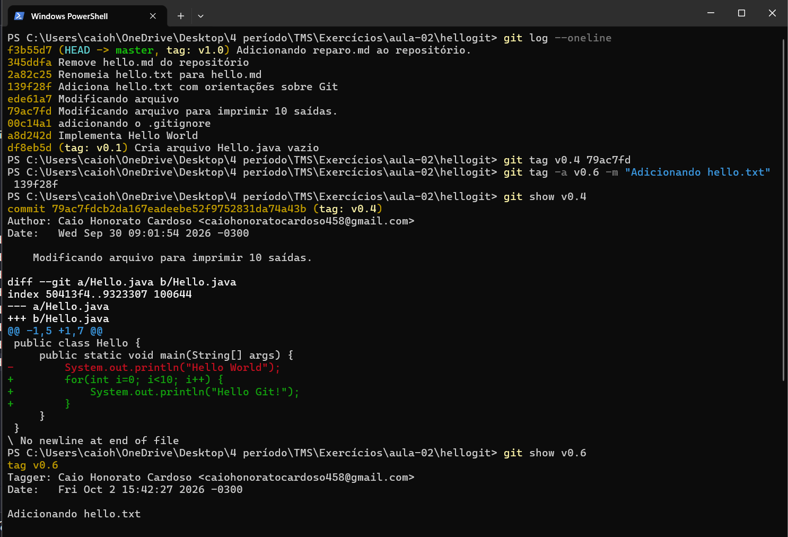
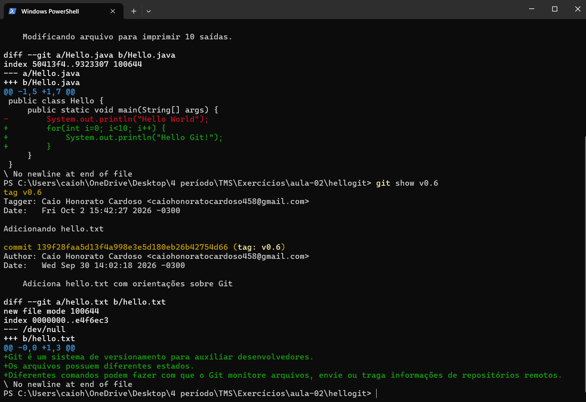

# Atividade 08

## Questão (1) Para os projetos pesquisados anteriormente, examine como (e se) foi feito o uso de tags. Verifique se há versões do projeto marcadas como tags e qual esquema de versionamento foi usado;

O Audacity usa tags extensivamente para marcar suas versões. O padrão de nomenclatura não é SemVer puro: as tags seguem o formato Audacity-X.Y.Z (com o prefixo Audacity-, não apenas vX.Y.Z como em outros projetos).

Observações sobre o esquema:

- Segue a lógica MAJOR.MINOR.PATCH (parecido com SemVer), mas com o nome do projeto embutido na própria tag

- Também há tags de pré-lançamento, como Audacity-4.0.0.alpha-2 e Audacity-3.2.0-beta, Audacity-3.2.0-alpha-1 e Audacity-3.0.3-RC1/RC2, usando sufixos alpha, beta e RC, exatamente os termos vistos nos slides da aula

- Cada tag corresponde a um commit específico de "preparação de release" (muitas mensagens de commit dizem algo como "Ready for release" ou "Set BUILD_LEVEL 2, in preparation for release")

## Questão (2) Pesquise outros projetos conhecidos e veja como é feito o uso das tags, por exemplo: como são nomeadas, quais commits foram marcados, quais informações foram registradas, de quanto em quanto tempo as tags foram criadas?

Analisando o Node.js:

- Nomeação: tags no formato vX.Y.Z (ex: v20.11.1), sempre com o prefixo v

- Commits marcados: o commit exato que fecha cada ciclo de release

- Informações registradas: tag anotada, com changelog detalhado na mensagem

- Frequência: lançamentos frequentes (a cada poucas semanas para versões menores; a cada ~6 meses para versões LTS)

## Questão (3) Tendo encontrado um repositório que faz uso de tags para versões, teste as opções de filtragem das tags, por exemplo, listando todos os commits associados a versão "1.1.*" do projeto (se existir).

<!-- Usando o repositório do Audacity, filtrei os commits associados às tags de commits que entraram entre o lançamento da 3.2.0 e o da 3.2.1 (ou seja, o que foi corrigido/adicionado nesse patch específico). -->

## Questão (4) Para o repositório criado como exemplo experimente criar tags e associá-las ao commit mais recente e também aos anteriores.

## Questão (5) Teste a criação de tags "anotadas" e "leves". Observe as diferenças.

