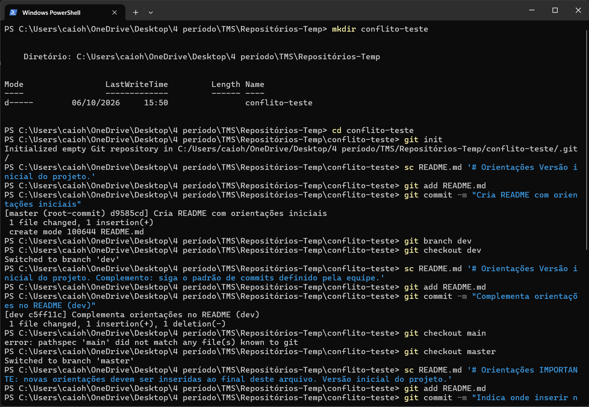
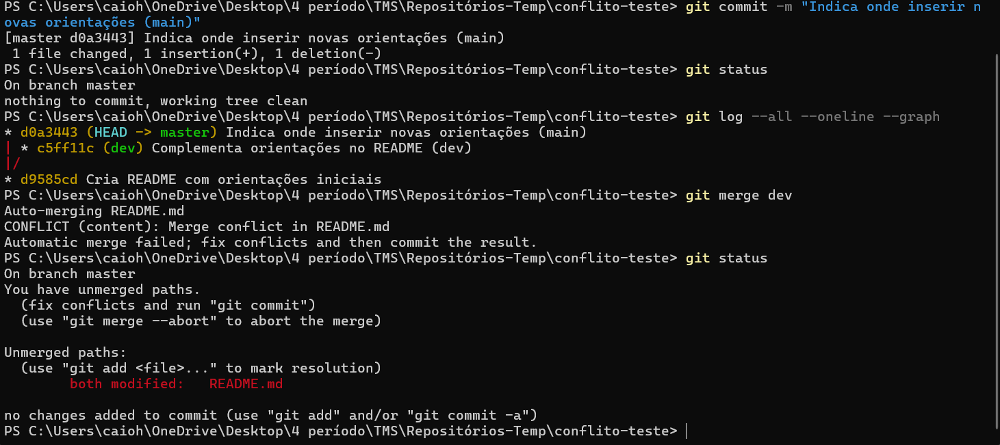
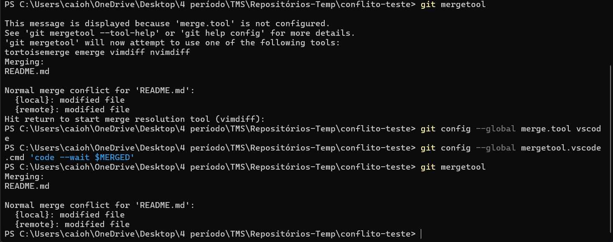

# Atividade 01

## Questões (1) - (6):

## Questão (7): Tente resolver os conflitos usando uma ferramenta auxiliar (se preciso repita o processo, simulando um novo conflito).

<!-- Não tinha nenhuma mergetool, configurei o vscode e fiz as mudanças nele mesmo. -->
